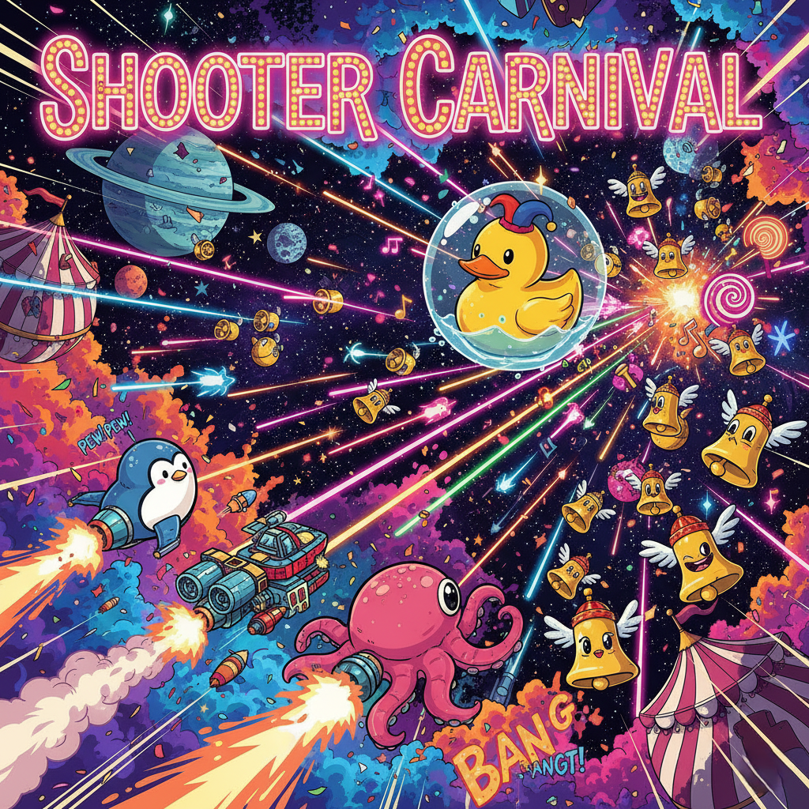

[](https://houzenkai.github.io/ShooterCarnival/index.html)

# Welcome to Shooter Carnival!

**Have you ever dreamed of building your own video game? Do you have fond memories of classic arcade shoot-'em-ups like *Gradius*, *R-Type*, *Twin Bee*, and *Galaga*? Then you've come to the right place.**

**Shooter Carnival** is a community-driven effort to build a spectacular, feature-rich 2D shoot-'em-up that serves as a playable love letter to the golden age of arcade games. We're creating a game that's not only fun to play but also incredibly fun and rewarding to build, together.

### The Mission: Learn, Build, and Play

Our goal is to create an open-source game where anyone, from absolute beginners to seasoned developers, can contribute meaningfully. This is a "Public Goods" project where the reward is what you create, what you learn, and the community you join.

*   **Build your portfolio:** Every merged pull request is a concrete addition to your development experience.
*   **Learn Godot & GDScript:** We provide a structured path with tutorials to help you learn one of the most exciting and user-friendly game engines available.
*   **Have fun:** We're making a game! The process should be as enjoyable as the final product.

### You Can Make a Game!

Worried about learning a new language? Don't be. We're using the **Godot Engine** with **GDScript**, a language so similar to Python that you'll feel right at home. If you are learning Python this a great opportunity to solidify your learning.

```gdscript
# This is GDScript. Looks familiar, right?
var speed = 400
var can_shoot = true

func _process(delta):
    var velocity = Vector2.ZERO
    if Input.is_action_pressed("move_right"):
        velocity.x += 1
    # ... and so on!
```

We've specifically designed our initial tasks to be incredibly welcoming to developers with a Python background. You can jump in and start contributing from day one.

### A Clear Roadmap to Success

This isn't a chaotic project that will fizzle out. We have a detailed development plan broken down into **Epics and Sprints**. Every feature, from the player's first shot to complex boss battles and weapon systems, is mapped out. You can see our progress, find a task that interests you, and know exactly how your contribution fits into the bigger picture.

### Your First Contribution is Waiting

Ready to join us? It's easier than you think.

1.  Check out our **[CONTRIBUTING.md](CONTRIBUTING.md)** guide for simple setup instructions.
2.  Head over to our **[Issues Tab](https://github.com/HouZenKai/ShooterCarnival/issues)** and look for a label called `good first issue`.
3.  Alternatively check our [Kanban tab](https://github.com/orgs/HouZenKai/projects/3/views/1) to see all tasks.  [Kanban?](https://youtu.be/VtFJhHEieHM)
4.  Grab an issue, make your contribution, and submit a pull request.
5.  Join our [Discord](https://discord.gg/nZFw5QpH5t) and share your feedback, comments and ideas, you can also follow us on [twiter/X](https://x.com/HouZenKai) and [Itch.io](https://houzenkai.itch.io/shooter-carnival), 

**No contribution is too small.** Whether you're fixing a typo, adding a sound effect, or implementing a new weapon system, your work is valued and will be immortalized in our `CONTRIBUTORS.md` file and the game's credits.

### Games we plan to homage

| Game                  | Year | Platform           | Notable for | Homage |
| :-------------------- | :--- | :------------------| :------------------------------------------------------------------------------------------------------------------------------------------ | :--- |
| **Aleste**            | 1988 | Sega Master System | Speed and complex power-up system, proved arcade-quality shooters were possible on home consoles.                                           | Its high-speed action and deep weapon system could inspire a "high-octane" challenge stage or a core mechanic for a fast-paced player ship. |
| **Axelay**            | 1992 | Super Nintendo     | Combined horizontal and pseudo-3D "Mode 7" vertical scrolling stages. Introduced a strategic weapon-loss system upon taking damage.         | The mix of vertical and horizontal stages is a perfect fit for a "carnival" theme, offering variety. |
| **Darius**            | 1987 | Arcade             | Innovated with a unique three-screen panoramic display and pioneered branching level paths, drastically increasing replay value.            | Branching paths allow the player to "choose their next attraction," adding significant replayability. |
| **DonPachi**          | 1995 | Arcade             | Originated the "bullet hell" (danmaku) subgenre, shifting focus to navigating dense bullet patterns and introducing a combo scoring system. | A "Shooter Carnival" would be incomplete without a "bullet hell" attraction, offering a modern, high-difficulty challenge for expert players. |
| **Einhänder**         | 1997 | PlayStation        | Introduced a deep tactical layer with its "Gunpod" system, allowing players to strip weapons from enemies and switch them on the fly.       | The weapon-stealing mechanic could be a unique game mode or power-up, like winning a prize (an enemy's weapon). |
| **Galaga**            | 1981 | Arcade             | Evolved the fixed-shooter by introducing enemies with dynamic entry formations and the risk/reward "dual fighter" capture mechanic.         | A retro-themed bonus stage or a "classic arcade" section could pay homage to this foundational game's patterns and risk/reward mechanics. |
| **Gradius**           | 1985 | Arcade             | Standardized the selectable power-up bar, where collecting items allowed the player to choose their next upgrade from a list.               | The iconic power-up bar is a proven, strategic upgrade system that could be a primary mechanic for player progression. |
| **Guardic**           | 1986 | MSX                | Broke from linear scrolling with large, maze-like levels that required exploration, blending action with adventure elements.                | An explorable "fun house" or "maze" level could break the pace from linear scrolling, adding a sense of discovery. |
| **Gunbird**           | 1994 | Arcade             | Solidified the character-focused shooter template, with a cast of characters having unique shot patterns, bombs, and story endings.         | Offering a cast of distinct playable characters, each a different "performer," would perfectly match the carnival theme. |
| **Ikaruga**           | 2001 | Arcade             | Revolutionized the genre by turning it into a puzzle game with its core polarity-switching mechanic (absorbing same-colored bullets).       | The polarity mechanic could be the basis for a unique "puzzle" or special stage that tests reflexes and pattern recognition. |
| **Last Resort**       | 1992 | Neo Geo            | Established a new standard for gritty, atmospheric art direction with its dark, detailed cyberpunk aesthetic inspired by *Akira*.           | Its aesthetic could inspire a darker-themed stage within the carnival, providing visual contrast. |
| **Parodius**          | 1988 | MSX                | Created the "cute 'em up" parody subgenre by satirizing *Gradius* with absurd, comical, and surreal themes.                                 | The self-referential humor and wacky themes are a natural fit for a "carnival" setting, allowing for playful and surreal level designs. |
| **R-Type**            | 1987 | Arcade             | Defined a more methodical, strategic shooter with the "Force," an indestructible, detachable drone used for both offense and defense.       | The "Force" drone concept could be implemented as a key power-up or a "helper" character won at a "skill tester" game. |
| **Raiden**            | 1990 | Arcade             | The archetype of the military-themed vertical shooter, perfecting the formula with satisfying weapons and polished presentation.            | Represents the quintessential, reliable attraction of the Shooter Carnival — pure, polished, and satisfying vertical shooting action. |
| **Space Manbow**      | 1989 | MSX2               | A technical showcase for the MSX2, featuring advanced parallax scrolling and detailed sprites uncommon on home computers at the time.       | Its focus on impressive visuals and detailed environments serves as a reminder to make the "carnival" a visually spectacular experience. |
| **Super Laydock**     | 1992 | Super Nintendo     | Notable for its weapon customization system, allowing players to combine parts to create unique shot types.                                 | A "build-a-weapon" workshop or customization screen before a level would add strategic depth and player expression. |
| **TwinBee**           | 1985 | Arcade             | Established the "cute 'em up" subgenre and pioneered simultaneous two-player co-op in a vertical shooter.                                   | Its bright, cheerful "cute 'em up" style and focus on co-op play are essential for a fun, accessible, all-ages carnival atmosphere. And two-player co-op. |
| **Xenon 2 Megablast** | 1989 | Amiga 500/Atari st | Featured an in-game shop for purchasing weapon upgrades between levels and use a dance track creating a high-energy atmosphere              | Using a high-energy track is perfect for a "main" attraction. The in-game shop directly translates to a "build-a-weapon" where players can spend tickets won from levels on new ship upgrades. |
| **Xexex**             | 1991 | Arcade             | Combined mechanics from its competitors, featuring a detachable drone like *R-Type* and charge shots like *Gradius*.                        | Its "best of both worlds" approach is the essence of a carnival, suggesting that combining mechanics from different classics can create a new experience. |
| **Zanac**             | 1986 | NES/MSX            | Featured a dynamic AI that adjusted the game's difficulty in real-time based on the player's actions.                                       | A dynamic difficulty system, adjusting the game's intensity, would keep the game challenging and engaging for all skill levels. |

Let's build something amazing together!
